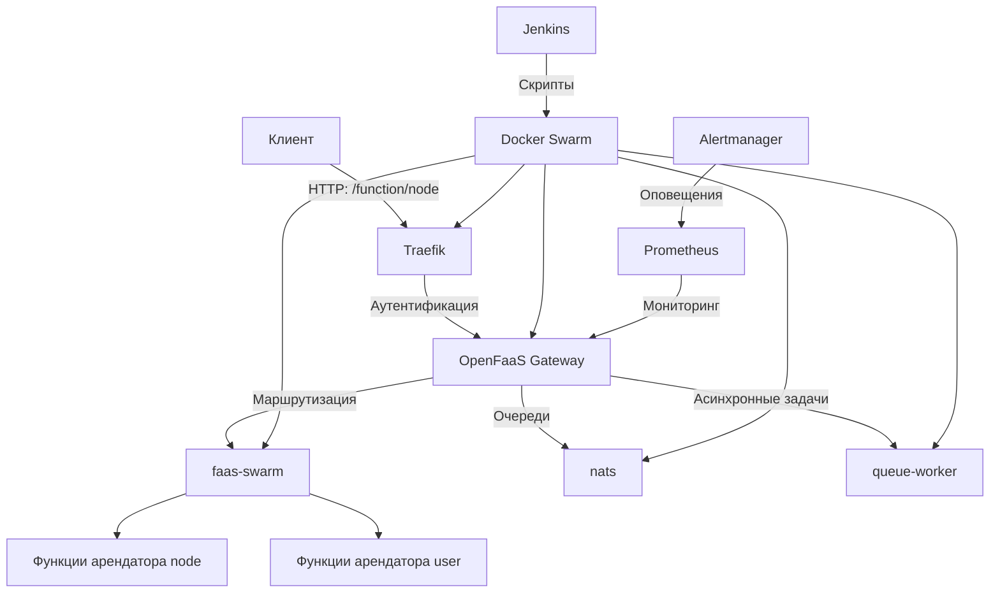

# Архитектура проекта OpenFaaS Auto-Deploy

Проект `openfaas-auto-deploy` реализует автоматизированное развертывание платформы OpenFaaS в Docker Swarm с поддержкой
мультиарендности через реверс-прокси Traefik. Изначально проект разрабатывался для интеграции с системой управления
облачными ресурсами Shipyard, но ввиду её текущей стадии разработки (июнь 2025) архитектура адаптирована для
самостоятельного использования. Проект направлен на упрощение DevOps-процессов в бессерверных вычислениях.

## Обзор архитектуры

Архитектура проекта основана на микросервисном подходе, где компоненты взаимодействуют через сеть Docker
Swarm (`overlay`). Автоматизация развертывания выполняется с помощью Jenkins-скриптов, а мультиарендность обеспечивается
Traefik. Система включает сервисы для управления функциями, мониторинга и маршрутизации запросов.

### Архитектурная схема



- **Клиент**: Отправляет HTTP-запросы (например, `http://localhost/function/node`).
- **Traefik**: Реверс-прокси, обеспечивающий маршрутизацию и аутентификацию.
- **OpenFaaS Gateway**: Центральный шлюз для вызова функций.
- **faas-swarm**: Провайдер для интеграции OpenFaaS с Docker Swarm.
- **nats**: Система очередей для асинхронных вызовов.
- **queue-worker**: Обработка асинхронных задач.
- **Jenkins**: Автоматизация развертывания.
- **Prometheus и Alertmanager**: Мониторинг и оповещения.
- **Docker Swarm**: Оркестратор для управления сервисами.

## Компоненты системы

1. **Jenkins**:
    - Роль: Автоматизация развертывания OpenFaaS.
    - Скрипты: `create_openfaas_swarm.groovy` (развертывание) и `destroy_openfaas_swarm.groovy` (удаление).
    - Функции: Генерация данных, запуск `docker-compose.yml`, проверка и обработка ошибок.
    -
    Файлы: [jobs/create_openfaas_swarm.groovy](../jobs/create_openfaas_swarm.groovy), [jobs/destroy_openfaas_swarm.groovy](../jobs/destroy_openfaas_swarm.groovy).

2. **Traefik**:
    - Роль: Реверс-прокси для маршрутизации запросов и мультиарендности.
    - Конфигурация: Использует Docker Swarm для автоматического обнаружения
      сервисов (`providers.docker.swarmMode=true`).
    - Аутентификация: Файлы `.htpasswd` (`users_admin.htpasswd`, `users_user.htpasswd`) для изоляции арендаторов.
    - Маршруты:
        - `/` и `/ui`: Доступ к интерфейсу OpenFaaS.
        - `/function/node`: Функции арендатора `node` (аутентификация через `users_admin.htpasswd`).
        - `/function/user`: Функции арендатора `user` (аутентификация через `users_user.htpasswd`).
    - Файл: [sources/docker-compose.yml](../sources/docker-compose.yml).

3. **OpenFaaS Gateway**:
    - Роль: Центральный компонент для обработки запросов к функциям.
    - Конфигурация: Использует образ `ghcr.io/openfaas/gateway:0.27.12`, поддерживает прямые вызовы
      функций (`direct_functions: true`).
    - Интеграция: Связан с `faas-swarm` и `nats` для маршрутизации и асинхронных задач.

4. **faas-swarm**:
    - Роль: Провайдер для интеграции OpenFaaS с Docker Swarm.
    - Образ: Собственный образ `vanmor78/faas-swarm:latest`, актуализированный для совместимости.
    - Функции: Управление функциями в Docker Swarm.

5. **NATS**:
    - Роль: Система очередей для асинхронных вызовов функций.
    - Конфигурация: Образ `nats-streaming:0.17.0` с in-memory хранилищем.

6. **Queue-worker**:
    - Роль: Обработка асинхронных задач.
    - Конфигурация: Образ `ghcr.io/openfaas/queue-worker:0.14.1`, интегрирован с `nats` и `gateway`.

7. **Prometheus и Alertmanager**:
    - Роль: Мониторинг производительности и оповещения.
    - Конфигурация: Prometheus (`prom/prometheus:v2.11.0`) собирает метрики, Alertmanager (`prom/alertmanager:v0.18.0`)
      отправляет уведомления.
    -
    Файлы: [prometheus/prometheus.yml](../prometheus/prometheus.yml), [prometheus/alertmanager.yml](../prometheus/alertmanager.yml).

8. **Docker Swarm**:
    - Роль: Оркестратор для управления сервисами и сетью `functions` (тип `overlay`).
    - Конфигурация: Все сервисы размещаются на узлах с `node.platform.os == linux`, некоторые (например, `faas-swarm`) —
      только на менеджерах.

## Технические решения

1. **Автоматизация через Jenkins**:
    - Jenkins-скрипты автоматизируют развертывание OpenFaaS, сокращая время с 67 до 19 секунд.
    - Этапы: генерация данных, запуск `docker-compose.yml`, проверка, обработка ошибок.
    - Преимущество: Упрощение DevOps-процессов, воспроизводимость.

2. **Мультиарендность через Traefik**:
    - Traefik обеспечивает изоляцию арендаторов через URL-пути (`/function/node`, `/function/user`) и базовую
      аутентификацию (`.htpasswd`).
    - Преимущество: Легковесный подход по сравнению с Kubernetes namespaces.
    - Подробности: [docs/multitenancy.md](multitenancy.md).

3. **Docker Swarm вместо Kubernetes**:
    - Выбор Docker Swarm обеспечивает меньшую ресурсоёмкость и простоту настройки.
    - Преимущество: Подходит для небольших кластеров и быстрого развертывания.

4. **Актуализация образов**:
    - Обновлены устаревшие образы OpenFaaS (например, `ghcr.io/openfaas/gateway:0.27.12`) и создан
      собственный `vanmor78/faas-swarm:latest`.
    - Преимущество: Совместимость с современными системами.

## Поток данных

1. Клиент отправляет HTTP-запрос, например:
   ```bash
   curl -u admin:password http://localhost/function/node
   ```
2. Traefik проверяет путь и применяет аутентификацию (`users_admin.htpasswd`).
3. Запрос перенаправляется к OpenFaaS Gateway (порт `8080`).
4. Gateway маршрутизирует запрос через `faas-swarm` к функции арендатора `node`.
5. Для асинхронных вызовов используется `nats` и `queue-worker`.
6. Prometheus собирает метрики, Alertmanager отправляет оповещения при сбоях.

## Потенциальная интеграция с Shipyard

Хотя Shipyard находится в разработке, архитектура спроектирована с учётом её интеграции:

- **Плагин Shipyard**: Структура репозитория (`assets`, `jobs`, `source`, `shipyard.yml`) адаптирована под требования
  Shipyard.
- **Jenkins-скрипты**: Могут быть интегрированы с Shipyard для управления облачными ресурсами.
- **Мультиарендность**: Traefik может быть настроен для маршрутизации запросов к функциям, управляемым Shipyard.

## Преимущества архитектуры

- **Эффективность**: Сокращение времени развертывания с 67 до 19 секунд.
- **Масштабируемость**: Docker Swarm и Traefik поддерживают добавление новых арендаторов и функций.
- **Мониторинг**: Prometheus и Alertmanager обеспечивают контроль производительности.
- **Воспроизводимость**: Jenkins-скрипты и документация упрощают развертывание.
- **Легковесность**: Docker Swarm требует меньше ресурсов, чем Kubernetes.

## Ограничения

- Базовая аутентификация через `.htpasswd` менее гибкая, чем OAuth/JWT.
- Ограниченная поддержка асинхронных функций из-за `nats` in-memory хранилища.
- Отсутствие текущей интеграции с Shipyard ограничивает облачные сценарии.

## Дополнительная информация

- Конфигурация: [sources/docker-compose.yml](../sources/docker-compose.yml).
- Мультиарендность: [docs/multitenancy.md](multitenancy.md).
- Репозиторий: [https://github.com/Vanmors/openfaas-auto-deploy](https://github.com/Vanmors/openfaas-auto-deploy).