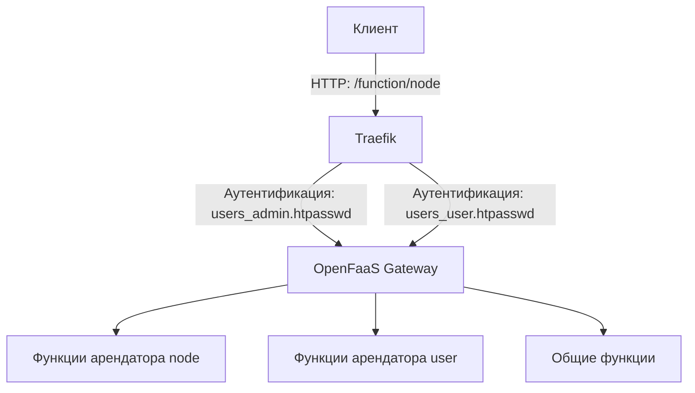

# Реализация мультиарендности в OpenFaaS

Проект `openfaas-auto-deploy` реализует мультиарендность (multi-tenancy) для платформы OpenFaaS, работающей в Docker
Swarm, с использованием реверс-прокси Traefik. Мультиарендность позволяет изолировать функции разных пользователей (
арендаторов), обеспечивая безопасный доступ к их ресурсам через единый шлюз. Эта функциональность разработана в рамках
проекта для конкурса «SITWare» и направлена на упрощение управления бессерверными приложениями в облачной среде.

## Принцип работы

Мультиарендность реализована через маршрутизацию запросов и аутентификацию на уровне Traefik, который выступает в
качестве реверс-прокси перед OpenFaaS Gateway. Каждый арендатор (например, `node` или `user`) имеет собственное
пространство функций, доступное по уникальному префиксу URL (`/function/<tenant>`). Доступ ограничивается с помощью
базовой HTTP-аутентификации, настроенной через файлы `.htpasswd`.

### Ключевые компоненты

- **Traefik**: Реверс-прокси, обеспечивающий маршрутизацию запросов и аутентификацию.
- **OpenFaaS Gateway**: Центральный компонент, обрабатывающий вызовы функций.
- **Docker Swarm**: Оркестратор, обеспечивающий масштабируемость и управление сервисами.
- **Файлы `.htpasswd`**: Хранят учётные данные для аутентификации арендаторов.

## Архитектура мультиарендности



- **Клиент** отправляет запрос (например, `http://localhost/function/node`).
- **Traefik** проверяет путь и применяет правила маршрутизации:
    - Для `/function/node` требуется аутентификация через `users_admin.htpasswd`.
    - Для `/function/user` — через `users_user.htpasswd`.
    - Для `/` или `/ui` доступ открыт (или ограничен через `users_common.htpasswd`).
- **OpenFaaS Gateway** направляет запрос к соответствующей функции арендатора.

## Техническая реализация

Мультиарендность реализована в конфигурации `docker-compose.yml` с использованием сервисов и меток Traefik.

### 1. Конфигурация Traefik

Traefik настроен как реверс-прокси с поддержкой Docker Swarm:

- **Entrypoints**: Порт `80` для HTTP-запросов и `8080` для панели управления Traefik.
- **Провайдер Docker**: Traefik автоматически обнаруживает сервисы в Docker Swarm
  через `providers.docker.swarmMode=true`.
- **Аутентификация**: Файлы `.htpasswd` (`users_admin.htpasswd`, `users_user.htpasswd`, `users_common.htpasswd`)
  монтируются как конфигурации Docker и используются для базовой HTTP-аутентификации.

### 2. Маршрутизация и изоляция

Traefik использует метки в сервисе `gateway` для маршрутизации и аутентификации:

- **Общий доступ**:
    - Правило: `PathPrefix(`/`) || PathPrefix(`/ui`)`.
    - Доступ к интерфейсу OpenFaaS и общим функциям (приоритет `1`).
    - Пример: `http://localhost/` открывает UI без ограничений (или с общей аутентификацией
      через `users_common.htpasswd`).
- **Арендатор `node`**:
    - Правило: `PathPrefix(`/function/node`)`.
    - Аутентификация: `auth-admin` middleware с файлом `users_admin.htpasswd`.
    - Приоритет `100` для перехвата специфичных путей.
    - Пример: Запрос `http://localhost/function/node` требует логина/пароля из `users_admin.htpasswd`.
- **Арендатор `user`**:
    - Правило: `PathPrefix(`/function/user`)`.
    - Аутентификация: `auth-user` middleware с файлом `users_user.htpasswd`.
    - Пример: Запрос `http://localhost/function/user` требует логина/пароля из `users_user.htpasswd`.

### 3. Файлы аутентификации

- Файлы `.htpasswd` содержат хэшированные пароли для каждого арендатора:
    - `users_admin.htpasswd`: Для доступа к функциям арендатора `node`.
    - `users_user.htpasswd`: Для доступа к функциям арендатора `user`.
    - `users_common.htpasswd`: Для общего доступа (если требуется).
- Пример создания файла `.htpasswd`:
  ```bash
  htpasswd -c users_admin.htpasswd admin
  ```
  (Введите пароль, например, `password`, для создания хэша.)

### 4. OpenFaaS Gateway

- Сервис `gateway` настроен для работы с Traefik через метки, указывающие порт (`8080`) и правила маршрутизации.
- Переменная `direct_functions: true` позволяет вызывать функции напрямую через сеть Docker Swarm.
- Поддержка мультиарендности обеспечивается изоляцией на уровне URL-путей, управляемых Traefik.

### 5. Docker Swarm

- Сеть `functions` (тип `overlay`) обеспечивает взаимодействие между сервисами (Traefik, OpenFaaS
  Gateway, `faas-swarm`, `nats`, `queue-worker`).
- Размещение сервисов (`node.role == manager`, `node.platform.os == linux`) гарантирует стабильность и совместимость.

## Использование мультиарендности

1. **Развертывание**:
    - Запустите стек OpenFaaS с помощью Jenkins-скрипта или вручную:
      ```bash
      docker stack deploy -c docker-compose.yml openfaas
      ```
    - Убедитесь, что файлы `.htpasswd` настроены и доступны.

2. **Проверка доступа**:
    - Доступ к общему интерфейсу:
      ```bash
      curl http://localhost/
      ```
    - Вызов функции для арендатора `node`:
      ```bash
      curl -u admin:password http://localhost/function/node
      ```
    - Вызов функции для арендатора `user`:
      ```bash
      curl -u user:password http://localhost/function/user
      ```

3. **Мониторинг**:
    - Используйте панель управления Traefik (`http://localhost:8080`) для проверки маршрутов.
    - Проверьте логи Traefik:
      ```bash
      docker service logs openfaas_traefik
      ```

## Преимущества подхода

- **Изоляция**: Каждый арендатор имеет собственное пространство функций, защищённое аутентификацией.
- **Легковесность**: Использование Docker Swarm и Traefik вместо Kubernetes снижает требования к ресурсам.
- **Гибкость**: Динамическая маршрутизация Traefik позволяет легко добавлять новых арендаторов.
- **Безопасность**: Базовая аутентификация через `.htpasswd` обеспечивает простой и надёжный контроль доступа.

## Ограничения

- Базовая аутентификация менее гибка по сравнению с OAuth или JWT.
- Текущая реализация требует ручного создания файлов `.htpasswd`.
- Масштабирование на большое количество арендаторов может потребовать дополнительных оптимизаций.

