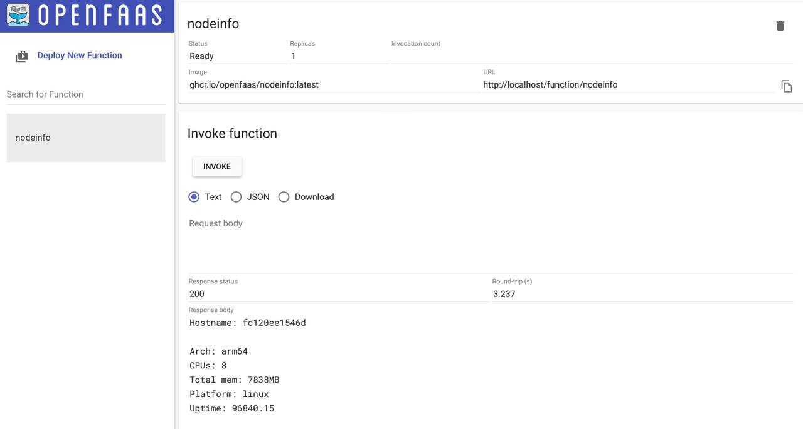

## Тема работы: Автоматизация развёртывания и управления для платформы OpenFaaS и её интеграция в систему управления облачными ресурсами в Shipyard.
Актуальность данной темы обусловлена высокой востребованностью бессерверных функций на мировом рынке, это показано на слайде. Также судя по аналитике в ближайшие 5 лет актуальность данной темы вырастет в разы.
На данный момент у многих популярных облачных провайдеров таких как Google, Amazon, Microsoft уже существуют бессерверные функции.

Исходя из этого была поставлена цель оптимизировать скорость развёртывания OpenFaaS посредством автоматизации и её интеграции в систему управления облачными ресурсами Shipyard.
Исходя из данной цели были сформулированы задачи, их вы можете увидеть на слайде.

Первым делом были проанализированы возможности развёртывания OpenFaaS, всего существует 3 варианта:
OpenFaaS c Kubernetes, OpenFaaS с Docker Swarm и faasd, который развёртывается на отдельном хосту и используется в основном для локального тестирования. Так как Shipyard живёт в контейнерном окружении Docker или Docker Swarm было принято решение использовать OpenFaaS вместе Docker Swarm.

Но из-за того, что проект faas-swarm не поддерживается разработчиками уже с 2020 года пришлось актуализировать некоторые Docker образы, а один из них собрать из исходником самостоятельно.

На изображении показан интерфейс запущенного локально OpenFaaS.

После проверки функциональности данного инструмента был проведён анализ плагинов в Shipyard. Именно с помощью них будет интегрирован OpenFaaS в облачное решение. На слайде представлена структура плагина для Postgresql. Остановлюсь на основных репозиториях в нём. Source и Jobs. Jobs используется для хранения Jenkins скриптов разработанных для автоматизации и управления плагином, а source для хранения в нём исходников, которые скрипты из jobs используют.

После изучения плагинов, был разработан скрипт для автоматизации развёртывания. В нём 4 этапа:
1. Генерация данных для аутентификации и устанавка faas-cli для работы с OpenFaaS из терминала.
2. Развёртывание сервисов в Docker Swarm.
3. Проверка работоспособность сервисов.
4. В случае неудачи в каком-то из трёх этапов выше, 4 этап сообщит об ошибке.

После разработки скриптов для развёртывания была проанализирована мультиарендная стратегия, которая поможет развёртывать один экземпляр OpenFaaS сразу для нескольких арендаторов. Всего было найдено 4 варианта её реализации:
1. Изоляция на уровне Gateway-инстанций;
2. Изоляция на уровне пространств имён в Kubernetes;
3. Изоляция через механизмы авторизации и маршрутизации;
4. Изоляция на уровне шаблонов функций.

Так как OpenFaaS вызывает свои функции через http запросы был выбран 3 вариант: изоляция через механизмы авторизации и маршрутизации.

В качестве маршрутизатора было принято решения использовать реверс-прокси. Из двух популярных решений реверс-прокси представленных на слайде был выбран Traefik, так как  он достаточно просто развёртывается и хорошо совместим с Docker Swarm.

После выбора реверс прокси была разработана конфигурация, которая представляла возможность развёртывать OpenFaaS сразу для нескольких арендаторов. На слйаде представлена часть данной конфигурации, выше настройка которая позволяет всем пользователям экземляра видеть свои функции, ниже настройка для арендатора node, который может вызывать свои функции с префиксом node. Другие же арендаторы не могут их вызвать.

На данном слайде показан вызов функции для арендатора node.

В результате работы развёртывание OpenFaaS получилось ускорить в 3 раза, с помощью выполненных задач представленных на слайде.